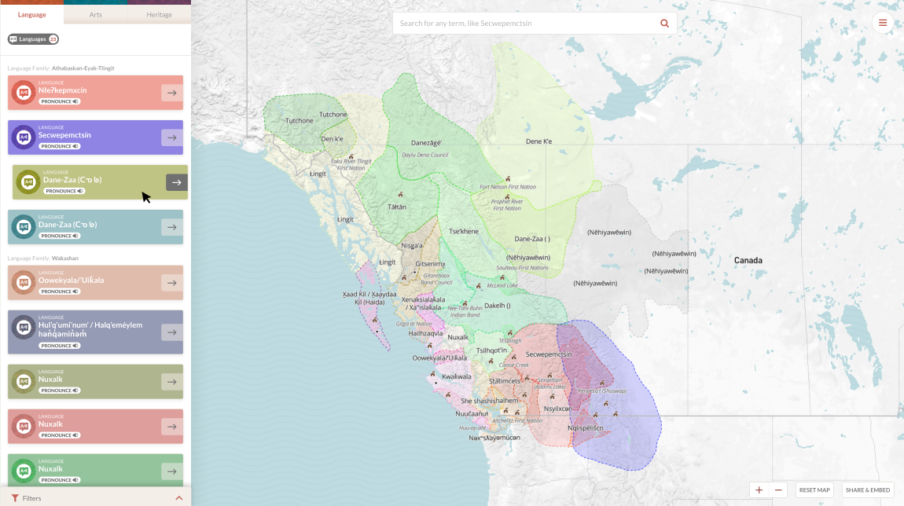
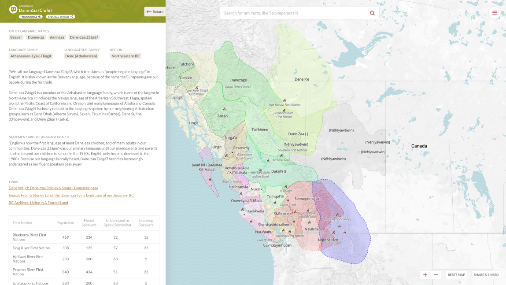
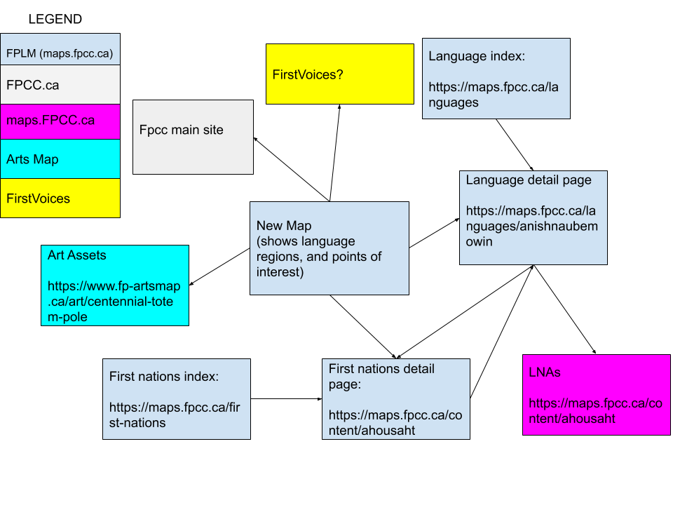
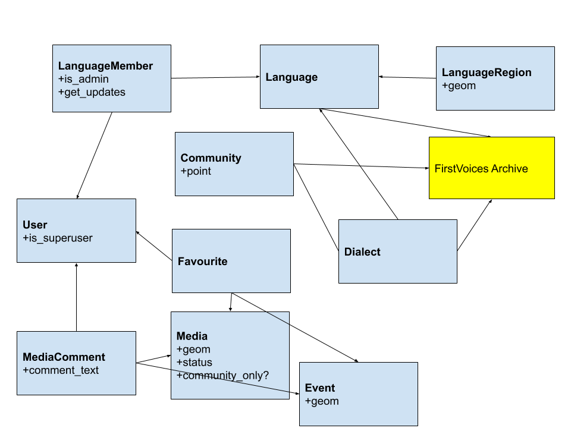

# First Peoples' Language Map (FPLM)

This repository contains planning materials for the FPLM web app project. The data intended for Phase 2 is here [MapBox base layer](https://api.mapbox.com/styles/v1/countable-web/cjwcq8ybe06so1cpin5lz5sfj.html?fresh=true&title=true&access_token=pk.eyJ1IjoiY291bnRhYmxlLXdlYiIsImEiOiJjamQyZG90dzAxcmxmMndtdzBuY3Ywa2ViIn0.MU-sGTVDS9aGzgdJJ3EwHA#4.78/52.44/-123.85).

## Deliverables

### Stakeholder Interviews
*Requrement: Interview key stakeholders at FPCC to gather, develop and document fine-tuned requirements (expressed as epics/user stories) and review existing deployments (https://www.fp-artsmap.ca, http://maps.fpcc.ca).*

  * Stakeholders from FPCC were interviewed and those discussions along with reviews of the existing deployments formed the basis of the [User Stories](https://docs.google.com/document/d/1PoplPndKe7XYzABfq_HEup7jxsyDEAGyz5p-_hfo_bk/edit#heading=h.ibwfjzmfr3dg)
  * Key observations from interviews are held in the [User Stories - Appendix D2](https://docs.google.com/document/d/1PoplPndKe7XYzABfq_HEup7jxsyDEAGyz5p-_hfo_bk/edit#heading=h.ibwfjzmfr3dg)
  * For interviewee privacy, the raw interview answers are not currently public [request access](https://docs.google.com/forms/d/1IQrmAR3WvaElUqNQQ44nh6mS92L4UsrTTOmqNM2gmY0/edit#response=ACYDBNgPnE6MSVW30CxZa744X3NjQqfTZkpy-KoWMjjMJvDrGrt2IzOsVuQcbcjsVmMoWUE)
  * Stakeholder interview [schedule](https://docs.google.com/spreadsheets/d/1blPhBSdzw7pOeUZGrMV1AiUTPvK9kGU4RLvchswdug4/edit#gid=669170734).

### Technology Options
*Requrement: Select and review technology options, including decision on a cross-platform deployment (Android/iPhone).*

  * See [User Stories - Appendix B](https://docs.google.com/document/d/1PoplPndKe7XYzABfq_HEup7jxsyDEAGyz5p-_hfo_bk/edit#heading=h.ibwfjzmfr3dg). Not all discussions surrounding these choices were documented. The key factor is the planning team demonstrated similar work and some prototyping using these stack components, and w recommend the implementing team use an appropriate technology stack they are experts in.

### Planning
*Requrement: Create wireframes, mock-ups, and technical designs based on requirements.*

#### WireFrames
  
  * Video navigating through media upload [wireframes](https://drive.google.com/open?id=1EmrvRhYHrxxtTHq4tIIPKtRb0ro6DaZS).

#### Mock-ups

Landing Page

Language Selected

Language Detail (TODO: map should zoom)

   * Video navigating through landing flows [mock-ups](https://drive.google.com/open?id=1YQ2PJAeml1cEhQsCwMk8o8CY2kiMAGgq).
   * Originals of Adobe design files [here](https://drive.google.com/drive/u/0/folders/1EUjSc2NAbVhD3fn6Pjj9_4OstD6pIE7E?ddrp=1). TODO @Felipe

#### Information Architecture
This diagram shows the relationship with FPLM to other web properties.

#### DB Schema
This diagram shows a high level proposed schema for the FPLM web app.

### Standards and Benchmarks
*Requrement: Set and document baselines in terms of performance, test coverage, accessibility, browser support, font support.*

  * Benchmarks are shared the [User Stories - Appendix A](https://docs.google.com/document/d/1PoplPndKe7XYzABfq_HEup7jxsyDEAGyz5p-_hfo_bk/edit#heading=h.ibwfjzmfr3dg).

### Distribution
*Requrement: All output and results from this step should be shared with FPCC in a digital, reusable format.*

  * [This repository](./) and the accompanying [public Google Drive folder](https://drive.google.com/drive/folders/1cJmyfs9K645JTUn_bHOebEF0BYIVUhuv?usp=sharing) contain all outputs of Phase 1.

### Other Stuff
This repository also contains.

  * An export of the MapBox theme files.
  * A script for importing the language regions, places, and community locations from a custom format to native geojson (see `scripts/convert.py`, it takes a raw file from `./data` as input.)
  * The MIT Licence (proposed by Vendor, awaiting approval)
